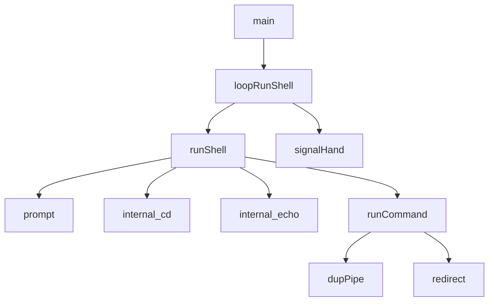
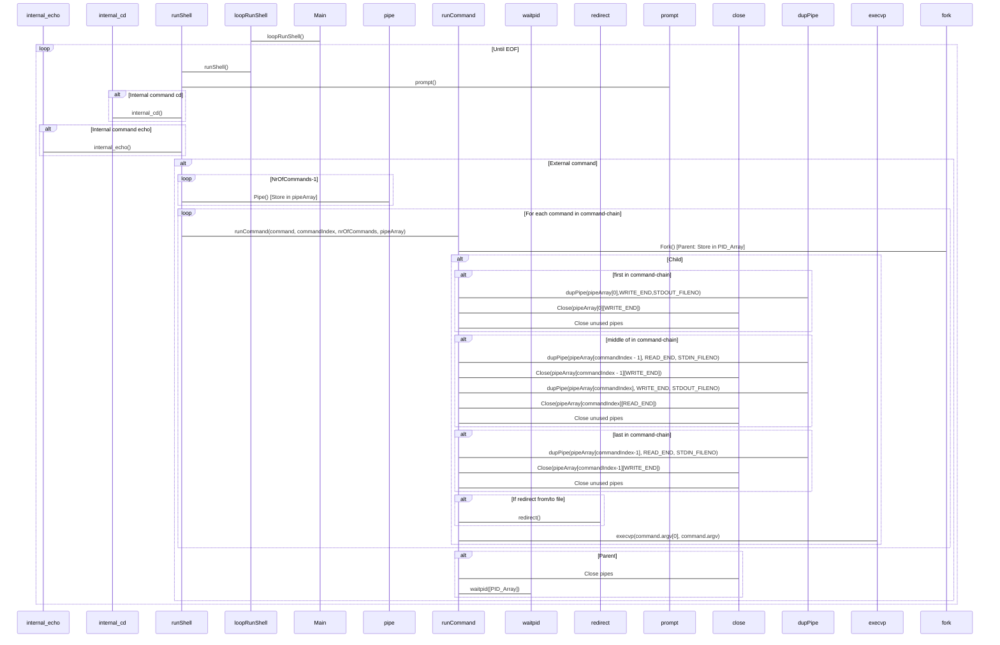

# Mish - Anropsdiagram

```mermaid
graph TD;
    main-->loopRunShell;
    loopRunShell-->runShell;
    loopRunShell-->signalHand;
    runShell-->prompt;
    runShell-->internal_cd;
    runShell-->internal_echo;
    runShell-->runCommand;
    runCommand-->dupPipe;
    runCommand-->redirect;
```

```mermaid
sequenceDiagram
    participant internal_echo
    participant internal_cd
    participant runShell
    participant loopRunShell
    participant Main
    participant pipe
    participant runCommand
    participant waitpid
    participant redirect
    participant prompt
    participant close
    participant dupPipe
    participant execvp
    participant fork
    Main->loopRunShell: loopRunShell()
    loop Until EOF
        loopRunShell->runShell: runShell()
        runShell->prompt: prompt()
        alt Internal command cd
            runShell->internal_cd: internal_cd()
        end
        alt Internal command echo
            runShell->internal_echo: internal_echo()
        end
        alt External command
            loop NrOfCommands-1
                runShell->pipe: Pipe() [Store in pipeArray]
            end
            loop For each command in command-chain
                runShell->runCommand: runCommand(command, commandIndex, nrOfCommands, pipeArray)
                runCommand->fork: Fork() [Parent: Store in PID_Array]
                alt Child
                    alt first in command-chain
                        runCommand->dupPipe: dupPipe(pipeArray[0],WRITE_END,STDOUT_FILENO)
                        runCommand->close: Close(pipeArray[0][WRITE_END])
                        runCommand->close: Close unused pipes
                    end
                    alt middle of in command-chain
                        runCommand->dupPipe: dupPipe(pipeArray[commandIndex - 1], READ_END, STDIN_FILENO)
                        runCommand->close: Close(pipeArray[commandIndex - 1][WRITE_END])
                        runCommand->dupPipe: dupPipe(pipeArray[commandIndex], WRITE_END, STDOUT_FILENO);
                        runCommand->close: Close(pipeArray[commandIndex][READ_END])
                        runCommand->close: Close unused pipes
                    end
                    alt last in command-chain
                        runCommand->dupPipe: dupPipe(pipeArray[commandIndex-1], READ_END, STDIN_FILENO)
                        runCommand->close: Close(pipeArray[commandIndex-1][WRITE_END])
                        runCommand->close: Close unused pipes
                    end
                    alt If redirect from/to file
                        runCommand->redirect: redirect()
                    end
                    runCommand->execvp: execvp(command.argv[0], command.argv)
                end
            end
            alt Parent
                    runCommand->close: Close pipes
                    runCommand->waitpid: waitpid([PID_Array])
            end
        end
    end
```
